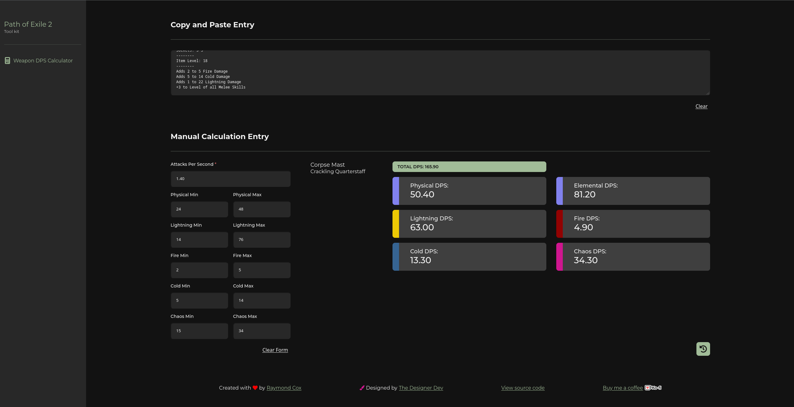
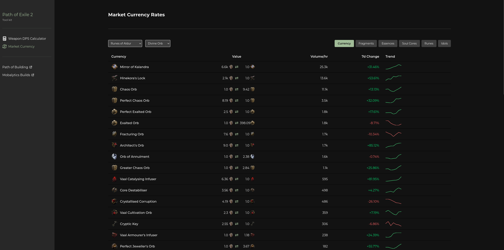

# poe2-tools

A browser-based toolkit for Path of Exile 2 players. Evaluate weapon damage and track live currency market rates without leaving the site.

## Summary

poe2-tools includes the following utilities:

### Weapon DPS Calculator



- Paste a weapon's item text directly from Path of Exile 2 to automatically extract damage stats.
- Manually enter Attacks Per Second and min/max values for Physical, Lightning, Fire, Cold, and Chaos damage.
- Instantly calculates Total DPS and per-damage-type DPS, shown as color-coded result cards.
- Keeps a local history of recent calculations.

### Market Currency Rates

 

- Browse live currency market data sourced from poe.ninja.
- Switch between available leagues and categories (Currency, Fragments, etc.).
- Choose a reference currency (Divine Orb, Exalted Orb, or Chaos Orb) to reprice every other rate.
- View exchange ratios, hourly volume, 7-day change percentage, and sparkline trends.

## Tech Stack

- React 19 + TypeScript
- TanStack Router + TanStack Start
- Tailwind CSS v4
- Vite
- Vitest + React Testing Library
- Biome

## Development

Requires Node.js >= 24.

```bash
npm install
npm run dev    # Start the dev server at http://localhost:3000
npm run verify # Run typecheck, lint, and unit tests
```

## Testing Strategy

The project uses three test layers. Unit tests run fast and isolated; smoke tests verify the production build against the live poe.ninja API; acceptance tests exercise full happy paths against a local mocked poe.ninja server.

| Suite | Runner | Scope | Data source | When it runs | Command |
| --- | --- | --- | --- | --- | --- |
| Unit | Vitest + React Testing Library | Components, utilities, API handlers, schemas | Mocked | Every PR (`.github/workflows/verify.yml`) | `npm run test:ci` |
| Acceptance | Playwright | Full happy paths: DPS paste/manual entry, currency league/category switching, navigation | Mocked poe.ninja | Every PR (`.github/workflows/verify.yml`) | `npm run test:e2e:acceptance` |
| Smoke | Playwright | App loads, pages render, no runtime errors | Live poe.ninja | Every push to `main` (`.github/workflows/smoke.yml`) | `npm run test:e2e:smoke` |

Both Playwright suites build the app (`npm run build`) before starting the preview server. Acceptance sets `USE_MOCK_POE_NINJA=true` to wire the app to the mocked server and runs with parallel workers; smoke runs serially and hits the real API. Unit tests enforce 100% coverage on the included source tree. Smoke tests are intentionally minimal and assertion-dense to avoid overloading the live poe.ninja API.

> **Deployment gate:** Smoke tests run on every push to `main`. A failing smoke workflow blocks the Railway deployment for that push, so a regression that breaks the live poe.ninja integration cannot reach production. Acceptance failures block PR merges via the verify workflow.

## Future Plans

- Item valuation for gear.
- Additional market overviews beyond currency.
